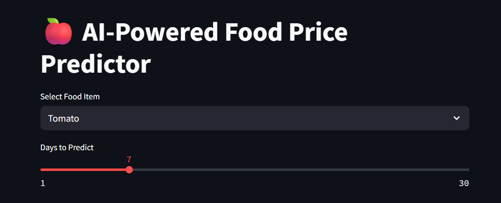
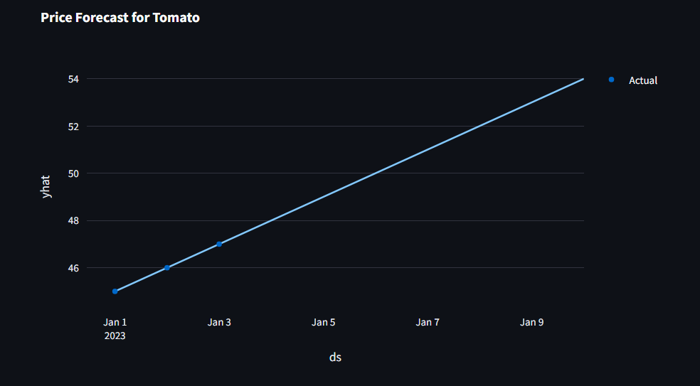

  <h2>🍎 AI-Powered Food Price Predictor 🌾</h2>
  

    A Streamlit web app that predicts future prices of food items using time-series forecasting. 
    Built with Facebook Prophet and Plotly to visualize trends. 
    Easy to use, customizable, and deployable for real-time insights.
  

   
  

  
  
  
  

---

### 🔧 Tools & Technologies

- **Python** (Pandas, Prophet, Plotly)  
- **Streamlit** (for UI)  
- **CSV Data** (historical food prices)  

---

### 📊 Features

- Selectable item-based forecasting  
- Adjustable prediction window (1–30 days)  
- Interactive Plotly line charts  
- Forecast table with predicted prices  

---

### 📁 Dataset

Includes sample CSV data for items like **Tomato** and **Potato** over 30+ days for demonstration.

---
